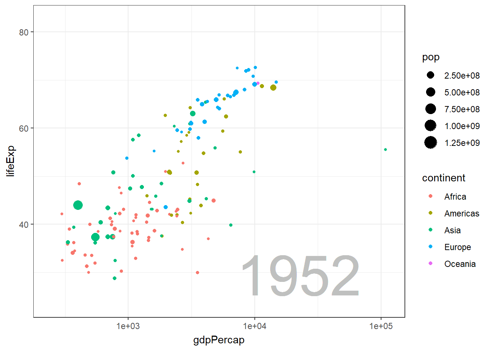

# gganimate 

 > This project is designed to give me the experience in using R, in particular gganimate package to create animation plots as part of my master subject assignment at **University of Technology Sydney**. 

## 🔧 Description

Data visualization is critical to any data science project because it enables effective data storytelling through graphs and plots. Additionally, data visualization with R is a necessary skill to develop in order to communicate effectively with stakeholders.

Concentrating on a statistical chart, on the other hand, is difficult in most cases, and you have no control over the pace at which the information is presented, particularly with time series analysis. The `gganimate` package extends `ggplot`, allowing us to create visually appealing data animations with only a few additional lines of code. Furthermore, we can customize and enhance the interactivity of your graphs. I will demonstrate how to further enhance these `ggplot` visualizations by animating them using the `gganimate` package in this report.

## ✨ Outputs
In our case we will use the `gapminder` dataset, as it is a classic dataset in the animation field. The final output will look like this:

  

## ✨ Contribution

Contributions, issues, and feature requests are welcome!

To contribute to this project, see the GitHub documentation on **[creating a pull request](https://help.github.com/en/github/collaborating-with-issues-and-pull-requests/creating-a-pull-request)**.

---

## 👏 Support

Give a ⭐️ if you like this project!

## 📝 Feedback

If you have any feedback or ideas to improve this project, feel free to contact me via

___________________________________

&copy; 2021 Leah Nguyen

